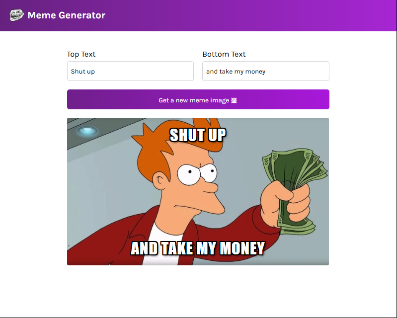

# Meme Generator App

A simple React web application that fetches random meme images from a meme API and lets you add custom top and bottom text.

---

## 🚀 Features

- Fetches random memes from a public meme API
- Lets you add your own top and bottom text
- Responsive and simple UI

---

## 📦 Installation

1. Clone the repo:
   ```bash
   git clone https://github.com/your-username/meme-generator.git
   cd meme-generator
   ```

Install dependencies:

```
npm install

Start the development server:
```

npm run dev

The app will be available at the port shown in your terminal.

🔑 API Setup
This project uses a meme generator API to fetch meme images.
👉 You will need to provide your own API endpoint.

Find a meme API you like (e.g. https://api.imgflip.com/get_memes or any other meme image source).

Open the fetch request inside WindowTracker.jsx (or wherever your API call is written).

Replace the placeholder with your API URL:

fetch("/_ get from internet your preferred memeGenerator API URL _/")

⚠️ Note: This repo does not provide an API key or URL. You must get your own for the app to work.

🛠️ Technologies

React
Vite (bundler)
JavaScript (ES6+)
CSS

📸 Demo

