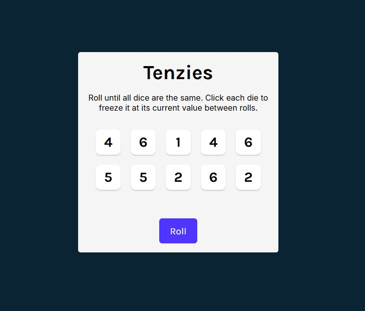
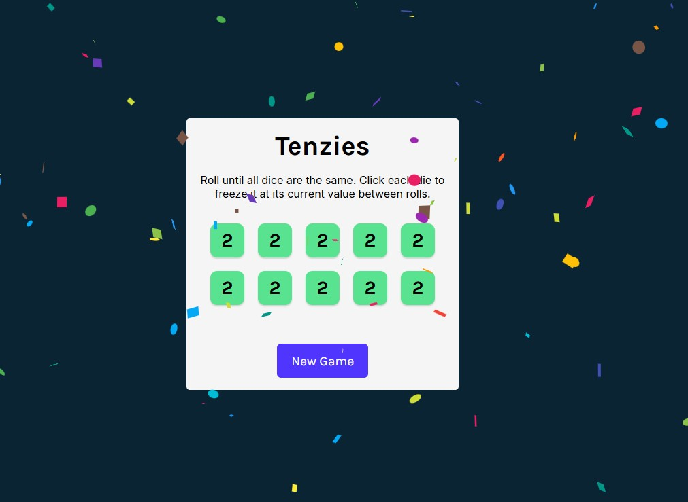

🎲 Tenzies

Tenzies is a React-based dice game where your goal is to roll until all dice show the same value.
Hold dice to lock them in place, and keep rolling until you win! 🎉

🚀 Features

Dynamic dice rolling – Roll 10 dice at once, with new random values each turn.

Hold functionality – Click on a die to “freeze” it between rolls.

Win condition – Game ends when all dice match and are held.

Confetti celebration – 🎊 Confetti rains down when you win.

Accessible gameplay – Screen reader announcements for win state.

Responsive UI – Works on both desktop and mobile screens.

🛠 Tech Stack

Frontend: React+ Vite

Styling: CSS

Unique IDs: nanoid

Animations: react-confetti

💻 Installation & Local Development

Clone this repo:

git clone https://github.com/your-username/tenzies.git
cd tenzies

Install dependencies:

npm install

Start the development server:

npm run dev

Open http://localhost:5173
in your browser.

📦 Build for Production
npm run build

🎮 How to Play

Click Roll to roll all 10 dice.

Click a die to hold its value.

Keep rolling until all dice show the same number.

When you win, confetti 🎊 will celebrate your victory!

Click New Game to play again.

📸 Demo

# Won!

